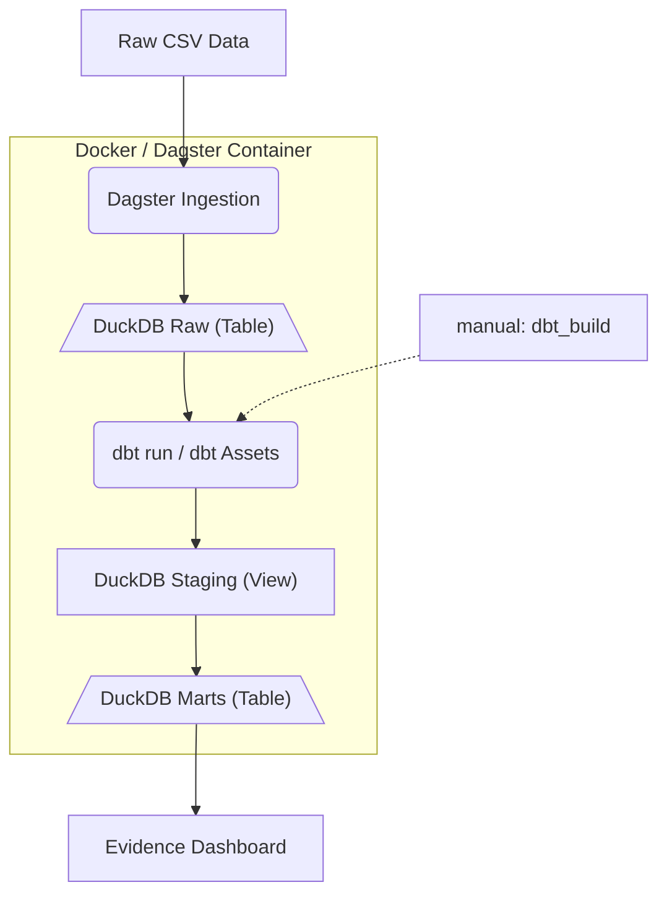

# demo-data-analytics-platform
Sample Production Data Analytics Pipeline 

## Goal

This repository delivers a lightweight, production-grade data analytics pipeline designed to demonstrate best practices in modern data platform engineering. 

The core philosophy centers on extreme simplification: deploying a complete, decoupled modern data stack locally, without incurring cloud provider costs. Built with modularity at its core, individual technologies in this stack can easily be swapped out as organizational scale or requirements change.

# Quick Start Guide

### Prerequisites
Ensure you have [Docker](https://www.docker.com/) and Docker Compose installed locally.

### 1. Start the Stack
Spin up the container network:

```bash
docker-compose up --build
```

### 2. Access the UIs
Once initialized, the services are accessible via your browser:
* **Dagster Orchestrator:** http://localhost:3000/
* **Evidence Analytics App:** http://localhost:3001/

### 3. Materialize the Assets
Navigate to the Dagster UI asset graph and trigger a manual run to materialize all assets. This execution sequence will process the sample e-commerce payload through the Raw -> Staging -> Marts data layers, building your physical data schemas inside DuckDB.

### 3. Rebuild Evidence Sources
To rebuild sources for evidence (once db's are updated), you can either restart the evidence container, or go to the settings page of evidence, and retest/save the existing source. Both of these will essentially rerun ```npm run sources```

To spin down or restart the stack later without rebuild overhead, simply run:

```bash
docker-compose up
```

## Design Philosophy

- **Local-First Modern Data Stack:** Providing a high-performance analytics ecosystem running entirely on local infrastructure.
- **Strict Decoupling:** Enforcing a clean separation of concerns between data ingestion, transformation layers, and business intelligence logic to simplify development and developer onboarding.
- **Zero Cloud Costs:** Leveraging powerful, open-source, or free-tier community tools to eliminate infrastructure overhead during prototyping and small-to-medium scale applications.
- **Architectural Scalability:** Utilizing a two-container architecture—one optimized for data orchestration/transformation (Dagster, dbt, DuckDB) and one dedicated to fast frontend data applications (Evidence.dev).
- **Actionable Insights:** Moving beyond simple data aggregation to deliver strategic analytics frameworks (e.g., quadrant analysis and positioning matrices) that drive real business decisions.

## Technologies Used

- **Docker:** Containerizes ecosystem services, ensuring immutable deployments and parity between local development and cloud replication.
- **Dagster:** Controls data orchestration. It provides a clean, unified control plane to manage asset dependencies, operational scheduling, job runs, and rich metadata visibility.
- **DuckDB:** Serves as the primary analytical database engine. Staging layer data is processed natively as in-memory views to eliminate temporary storage footprints, while raw and business-ready layers are written to highly optimized, file-based columnar storage.
- **dbt (dbt-core):** Drives data modeling, transformations, and testing within a unified Medallion architecture.
- **Evidence.dev:** Acts as the Business Intelligence (BI) application layer, enabling high-performance, responsive reporting applications built entirely using markdown and SQL as code.

---

## Data Architecture & Lineage

Data flows linearly from source files through progressive ingestion, staging, and modeling layers:



### 1. Raw Layer
- **Purpose:** Immutable landing zone for source data ingested directly from upstream environments.
- **Characteristics:** Schema-on-write constraints are minimal; files are stored exactly as received to preserve structural history.
- **Location:** Ingestion definitions are managed via standard Dagster assets under `dagster_pipelines/assets/raw/`. These assets are manually tagged into their appropriate groups/layers via their group_name in the asset definition.

### 2. Staging Layer
- **Purpose:** Conformed, enterprise-wide source of truth.
- **Characteristics:** Data is cast to explicit types, schema structures are normalized, null fields are structured, and keys are deduplicated (e.g., using `QUALIFY ROW_NUMBER()`). Staging tables are built primarily as fast database views.
- **Location:** Models are defined under `dbt_project/models/staging/` and backed by comprehensive schema freshness and data quality validation tests.

### 3. Marts Layer
- **Purpose:** Business-ready dimensional modeling layer.
- **Characteristics:** Optimized using dimensional frameworks (Star Schema Facts and Dimensions). It integrates complex business logic, performance aggregates, and analytical metrics ready for low-latency reporting queries.
- **Location:** Models are located under `dbt_project/models/marts/`.

## Orchestration Core Concepts: Naming, Keys, and Groups

To seamlessly bind dbt and Dagster together, the platform relies on a strict relationship between dbt model filenames, Dagster Asset Keys, and Asset Groups.

### 1. How Raw Assets are Named

Raw ingestion assets are managed directly via standard Dagster Python assets (located under dagster_pipelines/assets/raw/).

    The Rule: Python raw asset names match the naming conventions of the downstream dbt sources.

    Example: A raw ingestion asset that pulls CSV data for Amazon is named raw_az__sales. When it executes, it writes a physical table to DuckDB named raw_az__sales. This ensures that when dbt runs a source query, the underlying database objects match exactly what the orchestration layer produced.

### 2. Why We Need Asset Keys

An Asset Key is the unique identifier Dagster uses to track an object inside its internal state machine. It is the literal "node name" on your lineage graph.

    The Problem: By default, if a dbt model lives in a nested directory structure (like models/staging/amazon/stg_az__sales.sql), Dagster tries to generate a nested asset key like ["staging", "amazon", "stg_az__sales"]. However, inside dbt, cross-model relationships are defined as flat strings via {{ ref('stg_az__sales') }}. This mismatch completely breaks the visual lineage link between assets.

    The Solution: The custom get_asset_key method overrides this behavior by forcing a completely flat structure:
    Python

    return AssetKey([model_name])

    By keeping the asset key identical to the raw dbt model name (stg_az__sales), Dagster can read the dbt manifest.json, map the dependencies flawlessly, and track upstream-to-downstream telemetry without configuration conflicts.

### 3. Why We Need Asset Groups (and the Slash / Syntax)

An Asset Group is a logical boundary box used to organize a massive data warehouse canvas into distinct, digestible workspaces. Without groups, every single table and view in your warehouse would render into one giant, unreadable spiderweb of nodes.

Our architecture uses a dynamic translation strategy to split groups using a slash (vertical/layer) string syntax:

    The "Vertical" (Before the Slash): Represents the distinct domain or data pipeline pipeline (e.g., amazon_ecommerce, gaming_intelligence, etc). This creates top-level workspace separation in the Dagster UI sidebar, allowing engineers to filter down to only the project domain they care about.

    The "Layer" (After the Slash): Represents the structural lifecycle step (raw, staging or marts).

### Visual Impact on the UI

When you return a string formatted as vertical/layer (for example, amazon_ecommerce/staging), Dagster's UI engine performs two clean structural tricks:

    Sidebar Isolation: It groups the asset collection under the parent vertical (amazon_ecommerce) in your sidebar navigation.

    Canvas Containment: On the interactive global DAG graph, it draws a physical, distinct boundary box around assets in each layer.

This layout means you can look at the global orchestrator canvas and immediately see data traveling from the amazon_ecommerce/staging box directly into the amazon_ecommerce/marts box, visually proving your engineering principles are being enforced by the code execution engine.

---

## Technical & Design Considerations

### Automated Asset-to-Group Mapping
To streamline engineering workflows, this platform dynamically maps dbt models to their corresponding Dagster asset groups based entirely on filename keywords and prefixes. For instance, any model containing `az` or `amazon` is automatically routed to the **Amazon** data vertical, while prefixes like `stg_` isolate it down into the specific **Staging** execution layer box. 

This pattern makes it incredibly straightforward to scale out new parallel pipelines (e.g., *Gaming Intelligence*, *LA Analytics*) within the same repository without modifying complex python configuration arrays.

The logic is controlled via a custom `DagsterDbtTranslator` subclass inside `dagster_pipelines/assets/transformation.py`:

```python
from typing import Any, Mapping
from dagster import AssetKey
from dagster_dbt import DagsterDbtTranslator

class FutureProofVerticalTranslator(DagsterDbtTranslator):
    """
    Dynamically routes dbt models into logical Dagster asset groups
    based on naming conventions and project verticals.
    """
    def get_group_name(self, dbt_resource_props: Mapping[str, Any]) -> str:
        model_name = dbt_resource_props.get("name", "")
        
        # 1. Isolate the master operational vertical via keyword lookup
        if "az" in model_name or "amazon" in model_name:
            vertical = "amazon_ecommerce"
        # Other sample pipeliens (wip)
        elif "vg" in model_name or "gaming" in model_name:
            vertical = "gaming_intelligence"
        elif "la" in model_name or "city" in model_name:
            vertical = "la_analytics"
        else:
            vertical = "other_pipelines"

        # 2. Assign the internal lifecycle execution layer via model prefix
        if model_name.startswith("stg_"):
            layer = "staging"
        else:
            layer = "marts"  # Default mapping for dim_ and fct_ semantic structures

        # Returning 'vertical/layer' splits the asset catalog visually 
        # while drawing isolated physical boundary sub-boxes on the DAG canvas
        return f"{vertical}/{layer}"

    def get_asset_key(self, dbt_resource_props: Mapping[str, Any]) -> AssetKey:
        model_name = dbt_resource_props.get("name", "")
        # Keep underlying asset keys flat so dbt internal ref() resolution targets seamlessly
        return AssetKey([model_name])
```

### Docker Dev Optimization
The multi-container configuration is heavily optimized for localized feedback loops. Volume mounting is configured to handle seamless cross-container locks on the target DuckDB `.db` file, while hot-reloading is fully supported inside the Evidence container—meaning UI adjustments display immediately upon saving markdown files.

The github also includes blank duckdb files to make sure the evidence container runs immediately with new builds. This will be adjusted in the future to conform to best practices.

---

# Amazon Analytics Use Case

The Amazon data pipeline showcases a complete Business Intelligence application built with **Evidence.dev**, sitting directly on top of the modeled marts-layer data warehouse in DuckDB. 

Because real-world telemetry often lacks transactional line-item histories, this use case demonstrates how to design proxy models to extract competitive merchandising insights from marketplace listing constraints.

### Core Architecture Evaluated
- **Sourcing Volume Proxy:** Utilizes `rating_count` as a proxy calculation for total consumer engagement and transactional velocity.
- **Sentiment Metric:** Leverages listing `rating` to evaluate customer satisfaction thresholds.
- **Pricing Strategy Spreads:** Tracks the spread delta between standard retail targets (`actual_price` / MSRP) and current listing points (`discounted_price`).

---

### Applied Analytical Frameworks

The pipeline transforms uncleaned catalog attributes into four highly descriptive sourcing segments mapped dynamically in the analytics frontend:

1. **Prime Arbitrage Snipes:** Identifies premium listings possessing exceptionally strong customer feedback and high purchase volume, but currently trading significantly below their standard market price floor. These represent immediate margin opportunities for dropshipping or retail arbitrage.
2. **Hidden Gems:** Surfaces high-sentiment inventory (top-tier ratings) that is currently under-exposed or flying under the radar due to a lower overall volume of customer reviews.
3. **High-Churn Traps (Risky Products):** Flags products maintaining deceptive high-velocity interest but suffering from critically bad customer rating distributions. These indicate systemic product faults or high return-rate profile risks.
4. **Liquidating / Low Demand Stock:** Uncovers stale stock suffering from extreme discount cuts and low interest metrics—signaling an over-saturated or dead inventory niche.

---

### Key Application Features Included

- **Dynamic Cross-Filtering:** Built-in multi-input dropdown components filtering across Product Segments, Macro Sourcing Flags, and parsed Category Breadcrumbs simultaneously.
- **Arbitrage Efficiency Mapping:** Features an integrated data-driven scatter plot analyzing the interaction between relative discount depth (`Discount Percentage`) against exact absolute profit opportunities (`Arbitrage Spread ($)`), sized by transaction proxies.
- **High-Priority Sourcing Queue:** Provides an active daily checklist data engine that utilizes structured SQL `CASE WHEN` positioning blocks to automatically surface high-yield arbitrage margins to Row 1. The data view includes dynamic conditional formatting delta bars to instantly highlight margin spreads.

---

## Future Roadmap

The platform’s decoupled architecture is built to evolve. Future development is prioritized across three core technical tracks, advancing from infrastructure refinement to broader domain analytics and downstream predictive modeling.

### 1. Production-Grade Container Optimization
* **Multi-Stage Docker Builds:** Transition from the current local development setup to lean, multi-stage production Dockerfiles to minimize layer footprints, optimize build caching, and decrease image deployment sizes.
* **Granular Secret Management:** Replace plaintext local environment variables with secure handling (such as Docker Secrets or isolated, encrypted `.env` boundaries) to completely decouple operational infrastructure credentials from application code.
* **State Persistence Isolation:** Implement robust volume-mounting and connection-locking strategies to guarantee that the single-file DuckDB database state remains highly available and protected against corruption during concurrent container restarts.

### 2. Pipeline Expansion & Domain Diversification
* **LA City Logistics Pipeline:** Build a localized municipal data vertical parsing public city logistics and infrastructure feeds, testing the stack's ability to ingest and model spatial and temporal data frames natively within DuckDB.
* **Deadlock Gameplay Intelligence Engine:** Integrate a dedicated telemetry vertical parsing structured match logs and item data schemas from Valve's *Deadlock*. This pipeline moves beyond generic match tracking to deliver deeply personalized gameplay optimization frameworks:
    * **Graph-Based Item Dependencies:** Models multi-tier item scaling, stat-stacking behaviors, and soul-efficiency build pathways using relational dimension bridging.
    * **Spatio-Temporal Positioning Analytics:** Parses high-resolution time-series coordinate logs (`X, Y, Z` positional vectors) against match timelines to map optimal map positioning, team-fight positioning, and high-risk death zones correlated with overall win-rate metrics.
    * **Macro-Meta Trend Tracking:** Implements categorical investment tracking across Weapon, Vitality, and Spirit archetypes to dynamically surface emerging hero-specific build trends and broader systemic meta shifts.

* **POS Commercial Engine:** Deploy a Point-of-Sale (POS) data engine processing transactional retail payloads, serving as the foundational feature store for downstream retail optimization models.

### 3. Advanced Predictive Analytics & ML Integration
* **Automated Demand Forecasting:** Embed lightweight machine learning models (using `scikit-learn` or `Prophet` natively inside Python-based Dagster assets) to predict sales velocities and inventory consumption directly from POS metrics.
* **Arbitrage Propensity Scoring:** Develop an algorithmic scoring system that computes a dynamic probability matrix for listing churn, automatically flagging high-priority arbitrage targets that exhibit volatile supplier behavior.
* **Semantic Vector Search:** Explore the integration of the `duckdb_vss` extension to perform fast, localized semantic text embedding searches across uncleaned, messy marketplace catalog descriptions.